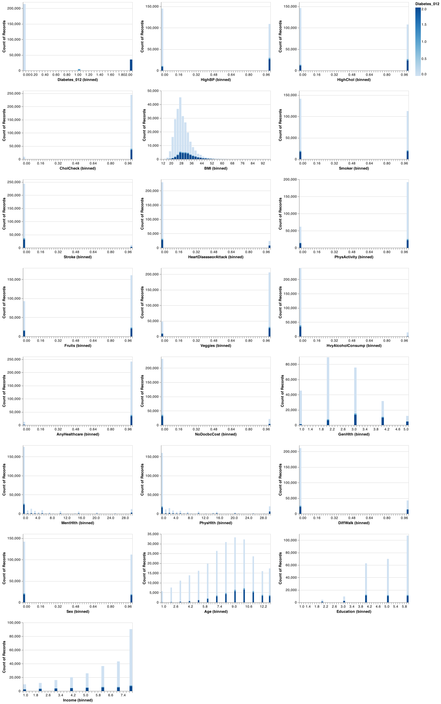
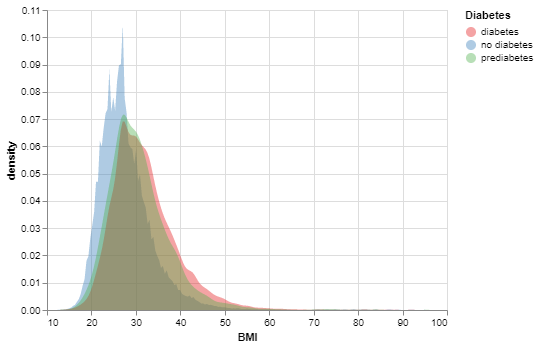
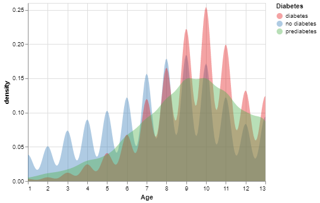
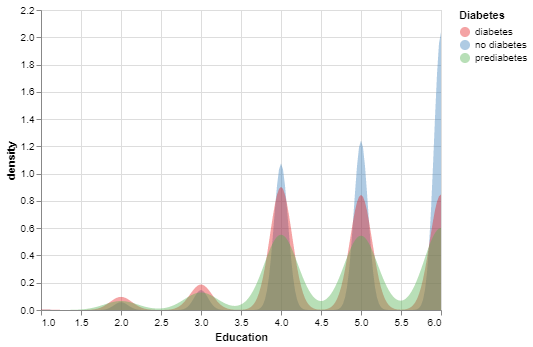
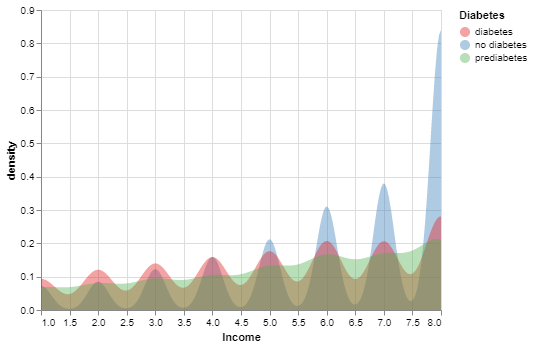

<style>
body {
fontsize: 24pt
text-align: justify}
</style>

```{r setup, include=FALSE}
knitr::opts_chunk$set(echo = FALSE)
library(tidyverse)
library(knitr)
library(kableExtra)
library(readxl)
```

```{r load results, message = FALSE}
cross_val <- read_csv("../results/cross_val_results.csv")
test_results <- read_csv("../results/final_test_results.csv")
correlation <- read_excel("../results/correlation.xlsx", sheet = "Sheet1")
```

# Project Overview
The prevalence and risk of diabetes are threatening us from all around the world. Various factors, including lifestyle, diet, and health information can facilitate diagnoses of this disease. Due to the advancements in data availability, modern data analysis techniques can be employed to speed up and improve the accuracy of disease diagnosis. In this report, we discuss our first attempt at predicting the diagnosis of diabetes, based on standard machine learning methods. 
It is worth noting that this project is not an original scientific research, and its results cannot be practically used or generalized. This is simply teamwork to cultivate what we have learned in the MDS program at UBC. 

# Introduction
Diabetes is a collection of metabolic diseases caused by persistently elevated blood sugar levels. Frequent urination, increased thirst, and increased appetite are common symptoms. Diabetes can lead to a wide range of health issues if neglected. Cardiovascular disease, stroke, chronic kidney disease, foot ulcers, eye damage, nerve damage, and cognitive impairment are examples of serious long-term consequences.
Diabetes is the seventh major cause of death in the world[@{2020top}]. It can simply double the risk of early death in people[@{2022Diabetes}]. According to the CDC’s National Diabetes Statistics Report for 2020, 34.2 million people (around 10.5% of the U.S. population) have diabetes in the United States. Among this amount of people about 7.3% have not yet been diagnosed [@{Home}]. Diabetes Canada delivers an alarming message regarding a similar situation in Canda: *"The new diabetes figures show a steady, continued increase in diabetes in our country with 11.7 million Canadians living with diabetes or prediabetes"* [@{Canada}].

The below table shows an estimation prevelance and cost of diabetes in British Columbia. 

```{r table1, echo=FALSE, message=FALSE ,warnings=FALSE, results='asis'}

tabl <- "
|Prevalence | 2022 | 2023 |
 :----------------|:------------------:|:----------------:|
|Diabetes <br> (type 1 + type 2 diagnosed + type 2 undiagnosed) | 825,000 / 16% | 1,075,000 / 19% | 
Diabetes <br> (type 1 and type 2 diagnosed) |577,000 / 11% | 753,000 / 13% |
Diabetes <br> (type 1) |                      5-10% of diabetes prevalence||
Diabetes <br> (type 1 + type 2 diagnosed + type 2 undiagnosed) and prediabetes combined|1,636,000 / 31% |1,970,000 / 35%|
Increase in diabetes (type 1 and type 2 diagnosed)  2022-2032 | 30% ||
Direct cost to the health care system | $565 million | $732 million |

| Out-of-pocket cost per year (2) |
|------|------|
|Type 1 diabetes on multiple daily insulin injections | $800–$2,800 |
|Type 1 diabetes on insulin pump therapy  | $800–$4,700 |
|Type 2 diabetes on oral medication | $1,500–$1,900 ||
Table1: Estimated Prevalence and Cost of Diabetes <br>
Sourse: Diabetes Canada [@{Diabetes}]

"
cat(tabl) 
```

According to the National Diabetes Statistics Report in 2020, during the period of 1999-2016 the age-adjusted prevalence of total diabetes have been increasing among adults 18 years or older. However, there is no significant changes reported in undiagnosed diabetes prevalence. 

```{r table2, echo=FALSE, message=FALSE ,warnings=FALSE, results='asis'}
tabl <- "
|Time Perion | Diagnosed diabetes <br> percentage (95% CI) | Undiagnosed diabetes <br> percentage (95% CI) | Total diabetes <br> percentage (95% CI) |
|:----------------|:------------------:|:----------------:|:---------------:|
|1999-2002| 6.4(5.8-7.0)| 3.1(2.6-3.7)| 9.5(8.7-10.4)|
|2001-2004| 7.1(6.5-7.8)| 3.2(2.7-3.8)| 10.3(9.4-11.3)|
|2003-2006| 7.4(6.7-8.1)| 2.8(2.2-3.6)| 10.2(9.3-11.2)|
|2005-2008| 7.7(6.9-8.5)| 2.9(2.4-3.6)| 10.6(9.6-11.6)|
|2007-2010| 7.9(7.1-8.7)| 3.2(2.7-3.7)| 11.1(10.1-12.2)|
|2009-2012| 8.1(7.4-8.9)| 3.2(2.6-3.8)| 11.3(10.3-12.3)|
|2011-2014| 8.7(8.1-9.4)| 2.7(2.3-3.3)| 11.5(10.7-12.3)|
|2013-2016| 9.4(8.6-10.2)|2.6(2.2-3.1)| 12.0(11.1-12.9)|

Table2: Trends in age-adjusted prevalence of diagnosed, undiagnosed, and total diabetes among adults aged 18 years or older, United States, 1999-2016 <br>
Sourse: Diabetes Canada [@{nhns}]

"
cat(tabl)
```

# Problem Statement and Methodology

The goal of this project is to create 5 competing machine-learning models and compare their performance in predicting whether a person has diabetes. 

* Dummy
* Decision Tree
* KNN
* RBF SVM
* Logistic Regression

# The process steps are the following:
* Downloading, cleaning, and preprocessing the CDC’s BRFSS data.
* Splitting and tran,.sforming the data
* Creating and training five above-mentioned classifier models. 
* Cross-validating and hyperparameter optimisation of the models.
* Report the performance results of the models based on their best hyperparameters.

#  Discussion
Firstly, let's look at the distributions of the features and target to get a better understanding of the data set. From the distribution of all features, it is immediately apparent that there is a significant class imbalance skewed towards individuals with no diabetes. Condsidering we are interested in predicting diabetes and not overly concerned with false positives, we need to focus on a model that prioritizes `recall` score. The graph below, illustrates the distribution of all features we have in data: 
```{r predictor-distributions, echo=FALSE, fig.cap="Figure 1. Comparison of the empirical distributions of people in the situation of diabetes, prediabetes, and with no diabetes.", out.width = '100%'}

``` 

The below graphs may help to look deeper:

As it is illustrative in Figure 2, there is significant distinction between the BMI-score distribution of the people with no diabetes and the people who have diabetes or in the pre-diabetes condition.
```{r bmi, echo=FALSE, fig.align = 'center', fig.cap="Figure 2. Comparison of the BMI distribution of people in the situation of diabetes, prediabetes, and with no diabetes.", out.width = '50%'}

``` 

The age distribution of these three group of people, shown in figure 3, indicates that the incidence probabilty of this disease in low-age is low. In other words, the age distribution of people with diabetes is more skewed to left than the age distribution of people with no diabetes. This evidence tells us that the feature of age can be crucial in this study.  
```{r age, echo=FALSE, fig.align = 'center', fig.cap="Figure 3. Comparison of the age distribution of people in the situation of diabetes ", out.width = '50%'}

``` 

The below graph shows that as the education level of people in this study increases it is less likely to have diabetes. 
```{r education, echo=FALSE, fig.align = 'center', fig.cap="Figure 4. Comparison of the education distribution of people in the situation of diabetes", out.width = '50%'}

``` 

In addition, there seems to be a negative relationship between income level and the incidence of diabetes.
```{r income, echo=FALSE, fig.align = 'center', fig.cap="Figure 5. Comparison of the education distribution of people in the situation of diabetes", out.width = '50%'}

``` 

# Summary 

To answer to the study question which is "Given a person's health indicators, can we know if he/she has diabete or not?", we have split the data into test and train and perfomed a transformation only on numeric features.
We have thereafter attempted to build different classification models using Dummy Classifier, Decision Tree Classifier, K-Neighbors Classifier, SVC  and Logistic Regression.  After looking  at cross-validations from the different models, the SVM and the Logistic Regression models had high recall and f1 scores. The two models were tuned and used on the test data. The f1 score for the tuned SVC was `r test_results[[2,3]]` as opposed to `r test_results[[2,6]]` for the tuned logistic regression. When it comes to the recall scores, the SVC performed `r test_results[[2,4]]` as opposed to `r test_results[[2,4]]` for the logistic regression. The two models are spotting a high proportion of actual positives which is in our case people with diabete.


# References